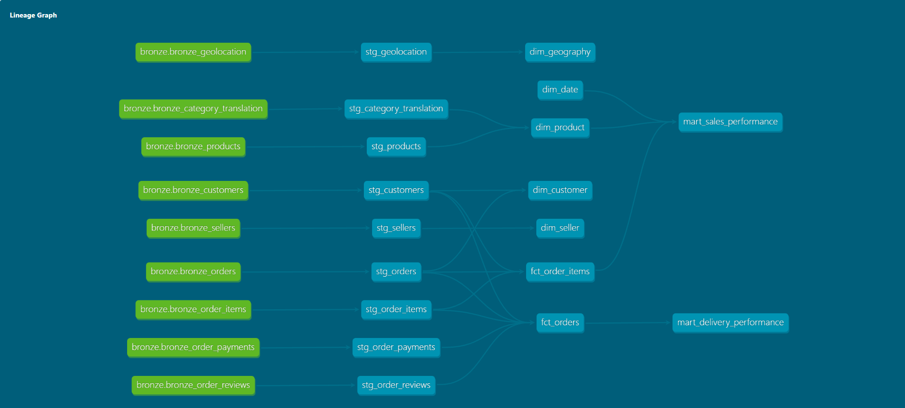

# olist-fabric-analytics
End-to-end analytics engineering pipeline on Microsoft Fabric - PySpark ingestion, dbt transformation, Power BI semantic layer

## Key Finding: Delivery Lateness Has a Non-Linear Effect on Satisfaction

Analysis of 95,830 delivered orders with reviews, from `gold.mart_delivery_performance`.

| Delivery vs estimate | Orders | Avg review | % negative (1–2) |
|---|---:|---:|---:|
| 10+ days early | 61,528 | 4.32 | 8.9% |
| 5–9 days early | 20,032 | 4.26 | 9.6% |
| 1–4 days early | 6,608 | 4.14 | 11.2% |
| On time | 1,280 | 4.03 | 12.4% |
| 1–4 days late | 2,288 | 3.14 | 36.7% |
| 5–9 days late | 1,861 | 1.89 | 73.8% |
| 10+ days late | 2,233 | 1.70 | 79.2% |

**The effect is a cliff, not a gradient.** Across the entire early range — from ten
days early down to on time — average review score falls only 4.32 to 4.03, a
0.29-point spread across 89,448 orders. The first day of lateness alone costs 0.89
points and triples the negative review rate. Customers treat the promised date as a
threshold to be met, not a target to be beaten.

**Estimates are systematically padded.** 92% of orders arrived early and 64%
arrived more than ten days early. That is rational insurance against the penalty
above, but it means the delivery estimate conveys little real information to the
customer — and 6,382 orders still missed it.

The practical implication: operational investment in reducing late deliveries
returns far more than investment in making early deliveries earlier.

## Architecture

Medallion architecture on Microsoft Fabric.

**Bronze** — raw ingestion. Nine Olist CSVs land in `Files/raw_data/` unmodified,
then load to Delta tables via PySpark with no transformation applied. Audit columns
(`_ingested_at`, `_source_file`) record lineage. Bronze is the reproducible starting
point: downstream layers rebuild from here rather than from the original source.

**Silver** — cleaning and conformance via dbt. Nine staging models applying type
casting, deduplication, null handling and business key definition, materialised as
views. Reads Bronze cross-database from the lakehouse SQL endpoint using three-part
naming, so no data is copied between layers.

**Gold** — dimensional model. Five dimensions and two facts with hashed surrogate
keys, plus two analytical marts. Items, payments and reviews are each pre-aggregated
to order grain before joining, preventing the fan-out that would otherwise inflate
revenue figures. 48 dbt tests cover uniqueness, referential integrity, accepted
values and composite grains.

### Design decisions

- **`inferSchema` on ingest.** Acceptable at 130MB; explicit schemas would be
  required at scale, where the extra read pass and inference errors on
  leading-zero fields become material.
- **`multiLine` and `escape` CSV options.** Review records contain free-text
  comments with embedded newlines and quotes. Without these, records split across
  rows silently — reconciliation confirmed 99,224 rows, matching source exactly.
- **Manual notebook export over Fabric Git integration.** Workspace-level Git sync
  requires a tenant-level switch not enabled in this environment. Notebooks are
  exported and versioned manually. In a production tenant, workspace sync to a
  dedicated branch would replace this.
- **Customer grain.** `customer_id` in the source is generated per order;
  `customer_unique_id` identifies the actual customer. The customer dimension is
  built on the latter, so repeat-purchase behaviour remains analysable.

### Lineage

