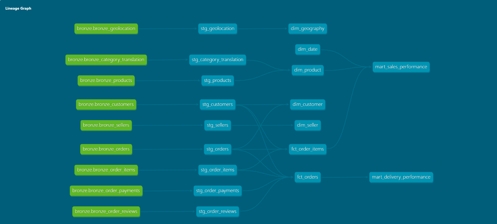
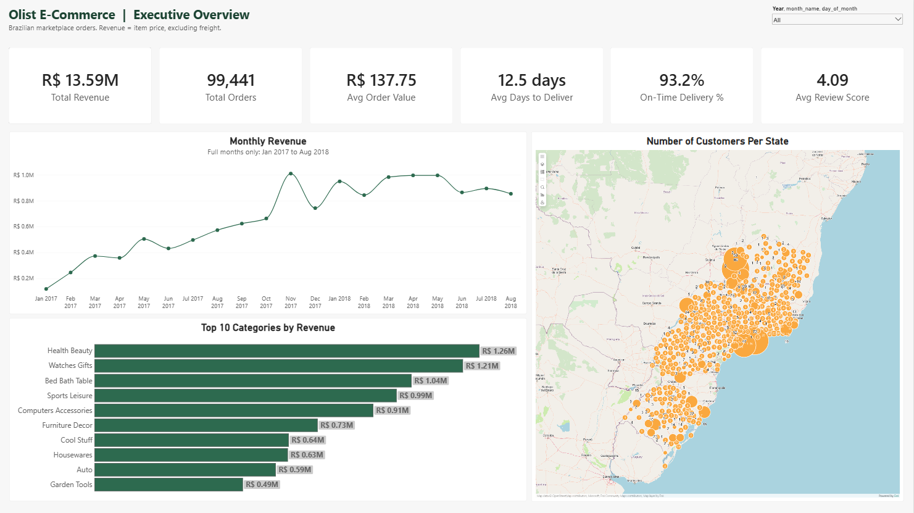
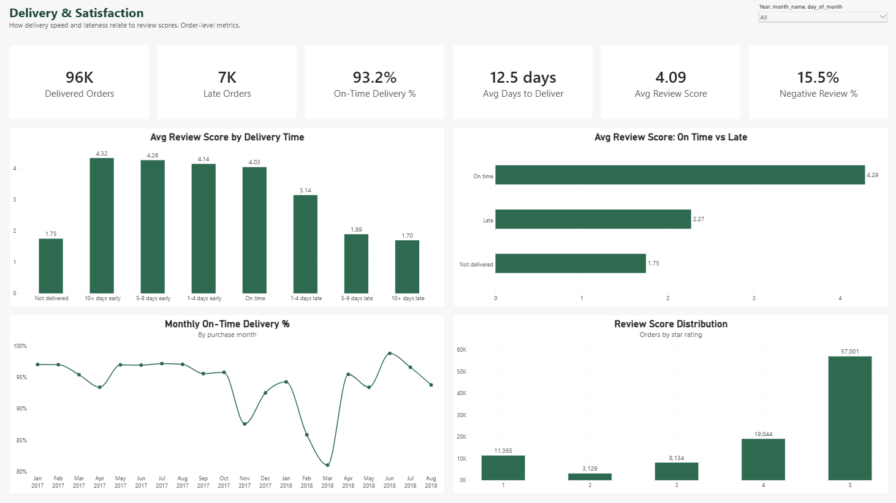
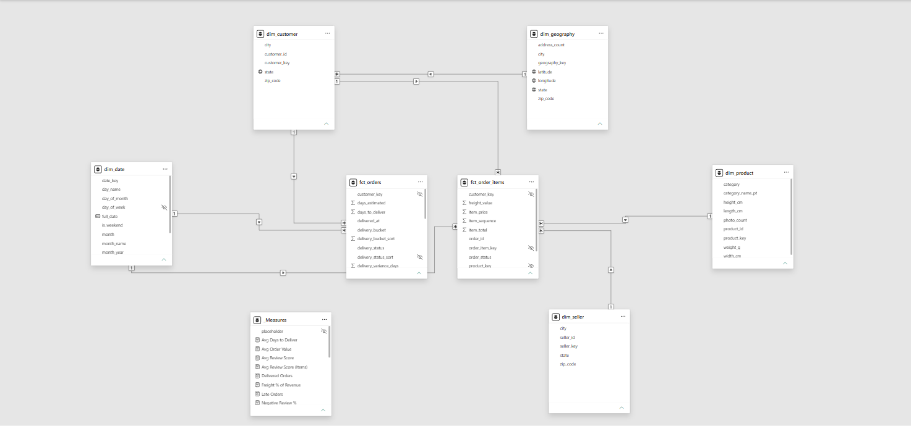
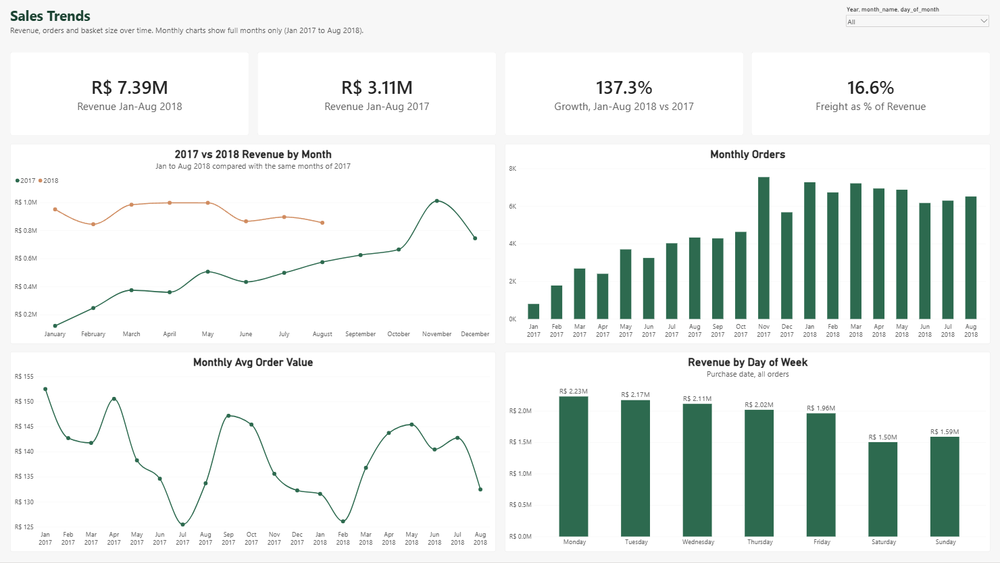
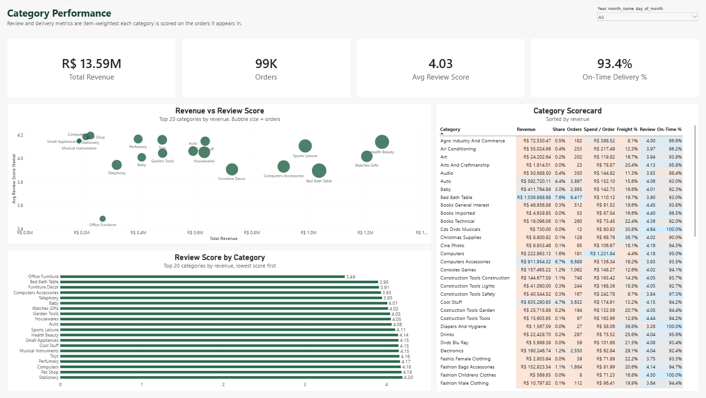
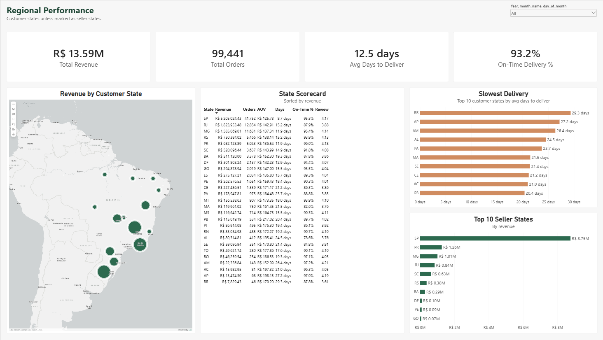
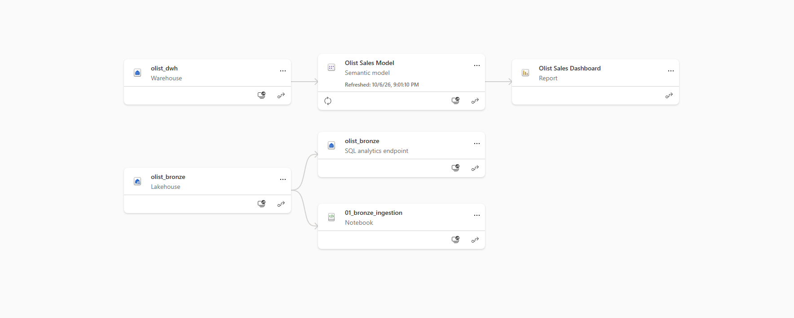

# olist-fabric-analytics
End-to-end analytics engineering pipeline on Microsoft Fabric - PySpark ingestion, dbt transformation, Power BI semantic layer

## Status

| Layer | State |
|---|---|
| Bronze ingestion (PySpark) | Complete |
| Silver, dbt staging | Complete |
| Gold, dims/facts/marts | Complete, 49 tests passing |
| Power BI report | Published to Fabric workspace (Import mode) |

## Running this project

**Prerequisites.** A Microsoft Fabric workspace with a warehouse, Python 3.11,
dbt-core 1.12, dbt-fabric 1.10, ODBC Driver 18 for SQL Server, and the Azure CLI.

**Data.** The Brazilian E-Commerce Public Dataset by Olist, from Kaggle
(`olistbr/brazilian-ecommerce`). Upload the nine CSVs to `Files/raw_data/` in the
lakehouse; the ingestion notebook reads them from there.

**Setup.**

```powershell
git clone https://github.com/Sakhekile715/olist-fabric-analytics.git
cd olist-fabric-analytics
python -m venv .venv
.venv\Scripts\activate
pip install -r requirements.txt
mkdir $HOME\.dbt -Force
copy profiles.yml.example $HOME\.dbt\profiles.yml   # then fill in your warehouse endpoint
az login --allow-no-subscriptions
```

**Run.** Install the dbt packages, run the Bronze notebook once to land the Delta
tables, then build the Silver and Gold layers:

```powershell
cd dbt\olist_analytics
dbt deps
# in Fabric: run notebooks/01_bronze_ingestion.ipynb
dbt build
```

## Key Finding: Delivery Lateness Has a Non-Linear Effect on Satisfaction

Analysis of 95,830 delivered orders with reviews, from `gold.mart_delivery_performance`.

| Delivery vs estimate | Orders | Avg review | % negative (1–2) |
|---|---:|---:|---:|
| 10+ days early | 61,528 | 4.32 | 8.9% |
| 5–9 days early | 20,032 | 4.26 | 9.6% |
| 1–4 days early | 6,608 | 4.14 | 11.2% |
| On time | 1,280 | 4.03 | 12.4% |
| 1–4 days late | 2,288 | 3.14 | 36.7% |
| 5–9 days late | 1,861 | 1.89 | 73.8% |
| 10+ days late | 2,233 | 1.70 | 79.2% |

**The effect is a cliff, not a gradient.** Across the entire early range — from ten
days early down to on time — average review score falls only 4.32 to 4.03, a
0.29-point spread across 89,448 orders. The first day of lateness alone costs 0.89
points and triples the negative review rate. Customers treat the promised date as a
threshold to be met, not a target to be beaten.

**Estimates are systematically padded.** 92% of orders arrived early and 64%
arrived more than ten days early. That is rational insurance against the penalty
above, but it means the delivery estimate conveys little real information to the
customer — and 6,382 orders still missed it.

The practical implication: operational investment in reducing late deliveries
returns far more than investment in making early deliveries earlier.

## Architecture

Medallion architecture on Microsoft Fabric.

**Bronze** — raw ingestion. Nine Olist CSVs land in `Files/raw_data/` unmodified,
then load to Delta tables via PySpark with no transformation applied. Audit columns
(`_ingested_at`, `_source_file`) record lineage. Bronze is the reproducible starting
point: downstream layers rebuild from here rather than from the original source.

**Silver** — cleaning and conformance via dbt. Nine staging models applying type
casting, deduplication, null handling and business key definition, materialised as
views. Reads Bronze cross-database from the lakehouse SQL endpoint using three-part
naming, so no data is copied between layers.

**Gold** — dimensional model. Five dimensions and two facts with hashed surrogate
keys, plus two analytical marts. Items, payments and reviews are each pre-aggregated
to order grain before joining, preventing the fan-out that would otherwise inflate
revenue figures. 49 dbt tests cover uniqueness, referential integrity, accepted
values and composite grains.

### Design decisions

- **`inferSchema` on ingest.** Acceptable at 130MB; explicit schemas would be
  required at scale, where the extra read pass and inference errors on
  leading-zero fields become material.
- **`multiLine` and `escape` CSV options.** Review records contain free-text
  comments with embedded newlines and quotes. Without these, records split across
  rows silently — reconciliation confirmed 99,224 rows, matching source exactly.
- **Manual notebook export over Fabric Git integration.** Workspace-level Git sync
  requires a tenant-level switch not enabled in this environment. Notebooks are
  exported and versioned manually. In a production tenant, workspace sync to a
  dedicated branch would replace this.
- **Customer grain.** `customer_id` in the source is generated per order;
  `customer_unique_id` identifies the actual customer. The customer dimension is
  built on the latter, so repeat-purchase behaviour remains analysable.
- **Delivery bands live on the fact, not in a dimension.** `delivery_bucket` is
  defined once in a macro and materialised on `fct_orders` alongside
  `delivery_bucket_sort`. `mart_delivery_performance` reads both from the fact
  rather than recomputing them, so the definitions cannot drift apart.
- **Report versioned as `.pbip`, not `.pbix`.** The binary `.pbix` format can't be
  diffed or reviewed in a pull request, so the report lives in `powerbi/` as a PBIP
  project: the semantic model is TMDL and the report definition is JSON, both plain
  text. A `.pbix` with the data embedded is published as a release download instead.
- **Lateness is judged at date grain.** The promised delivery is a calendar date,
  so an order delivered on that date is on time. `is_late` is defined once in a
  macro using the same date-level logic as the delivery bands, and a dbt test
  fails if the two ever disagree. Fixing it moved 1,292 on-the-day orders from
  late to on time.

### Lineage



## Power BI Report

A Power BI semantic model over the Gold warehouse tables feeds a five-page report
published to the Fabric workspace. Revenue is item price excluding freight, and the
monthly charts show full months only (January 2017 to August 2018).

**Viewing the dashboard**

- **PDF**: all five pages in [`docs/olist-sales-dashboard.pdf`](docs/olist-sales-dashboard.pdf),
  viewable in the browser.
- **Interactive**: download `Olist Sales Dashboard.pbix` from the
  [latest release](https://github.com/Sakhekile715/olist-fabric-analytics/releases/latest)
  and open it in Power BI Desktop (free, Windows). The data is embedded, so no
  Fabric access is needed.
- **Source**: the PBIP project in [`powerbi/`](powerbi/), with tables, relationships
  and DAX measures as TMDL and the report pages as JSON. It connects to the Fabric
  warehouse, so it opens without data unless it can refresh against it.



**Pages**

- **Executive overview** — headline KPIs (revenue, orders, average order value,
  delivery time, on-time rate, review score), monthly revenue, top ten categories
  by revenue and a customer map.
- **Sales trends** — January–August 2018 revenue against the same months of 2017,
  monthly orders, monthly average order value and revenue by day of week. Monthly
  charts are limited to full months: 2016 holds only 329 orders across three
  non-contiguous months, and the collection stops mid-September 2018.
- **Delivery & satisfaction** — the delivery finding above as a report page:
  average review score by delivery band, on time versus late, monthly on-time rate
  and the review score distribution.
- **Category performance** — revenue against review score for the top 20
  categories, the lowest-scoring categories, and a scorecard with revenue share,
  spend per order, freight share, review score and on-time rate.
- **Regional performance** — revenue by customer state on a map, a state
  scorecard, the ten slowest states by delivery time and the top ten seller states
  by revenue.



**Semantic model.** Two fact tables, `fct_orders` (order grain) and
`fct_order_items` (item grain), share the date and customer dimensions, and
products and sellers attach to items. `dim_geography` joins to `dim_customer` on
`zip_code`, which drives the map visuals. Measures live in a dedicated `Measures`
table.



<details>
<summary>More report pages and workspace lineage</summary>









</details>

### Design decisions

- **Import mode, not DirectLake.** Olist is a static historical dataset, so
  DirectLake's main advantage — reading fresh data straight from OneLake without a
  refresh — doesn't apply. Import also makes the report self-contained: the data
  travels with the model instead of depending on running Fabric capacity, which
  matters on a trial. For changing data in production I would use DirectLake to
  avoid refresh schedules and duplicated storage.
- **Two review-score measures.** `Avg Review Score` is order-level (4.09).
  `Avg Review Score (Items)` is item-weighted (4.03) and drives the category page,
  where each category is scored on the orders it appears in. The pages state which
  one they use.
- **Revenue excludes freight.** Revenue is item price only, as stated on the
  overview page; freight is reported separately as a share of revenue.
